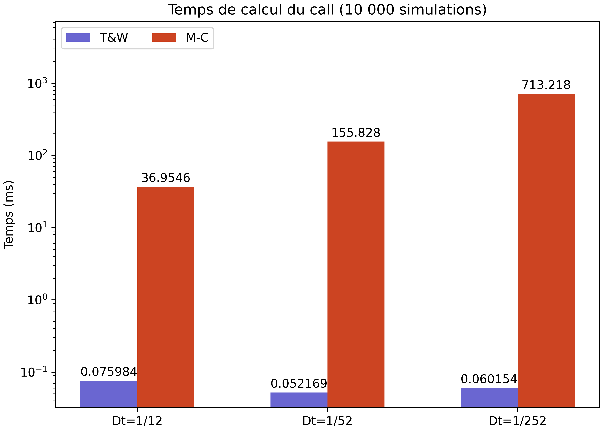

# Pricing of an Asian option

The repository contains multiples techniques to price asian options

## Turnbull & Wakeman aproximation

Turnbull & Wakeman have proposed an approximation of the asian option whose computation only required the last price instead of the whole path. It is very cheap to compute but we show that depending on the parameters for the option, it can be unprecise.

## Monte-Carlo simulation

Using a Monte-Carlo simulation solves the issue because it is unbiased, its calculation is straight forward but we observed that it takes many iterations before it gets accurate.

## Control variates

The control variate method allows us to create a Monte-Carlo method that converges much faster.

## Computation time

